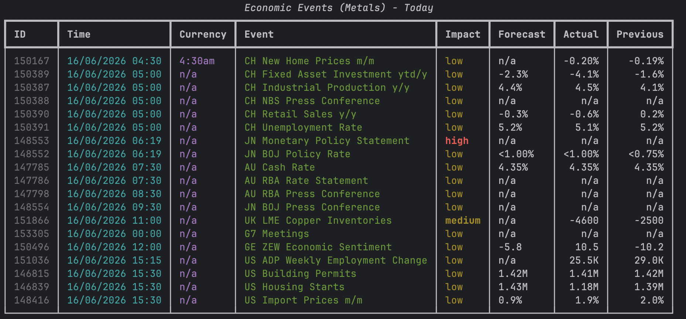
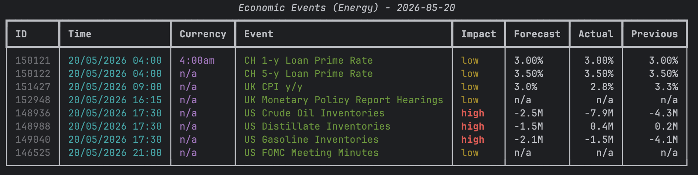
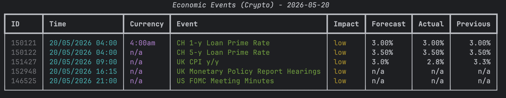
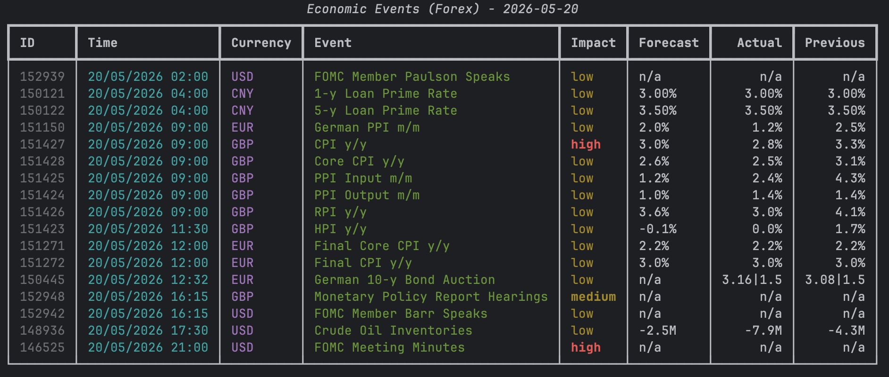

<div align="center">
  <h1>🎛️ • FOREX PYTORY</h1>
  <p><b>Advanced, Modular, and MCP-Ready Economic Events Scraper Library</b></p>
  <br>

  
  
  
  
  

</div>

<br>

**Forex-Pytory** is an open-source Python package that provides a robust and elegant way to scrape core economic data, news releases, and calendar events from major financial markets. Designed for modern Python ecosystems, it offers seamless integration for automated trading bots, data analysis pipelines, and even AI agents.

## ✨ Key Features & Capabilities

* 🌐 **Unified Multi-Source Engine:** 
  Stop writing different scrapers for different sites! This package natively supports **ForexFactory** (Forex), **CryptoCraft** (Crypto), **EnergyExch** (Energy), and **MetalsMine** (Precious Metals) through a single, consistent API. You get the exact same data structure regardless of which market you are querying.

* 🛡️ **Strict Type Safety with Pydantic v2:** 
  No more dealing with messy, unpredictable dictionaries. Every single event scraped from the web is parsed, validated, and cast into an `EconomicEvent` Pydantic model. This guarantees type safety, automatic data casting, and clean IDE autocompletion for fields like `impact`, `forecast`, `actual`, and `time`.

* 💻 **Powerful CLI (Command Line Interface):** 
  Need a quick market overview without writing code? The built-in CLI tool powered by `Rich` lets you pull and visualize data directly in your terminal. You can instantly view events in beautifully color-coded tables (where colors indicate market impact) or export them as raw JSON for external ingestion.

* 🤖 **MCP (Model Context Protocol) Ready:** 
  Welcome to the future of AI tooling. This package ships with an official MCP Server integration. This means AI Agents (like Claude 3.5 Sonnet) can securely connect to this library and invoke it as a local tool to answer your complex financial questions, summarize the daily calendar, or analyze upcoming high-impact events autonomously.

---

## 🚀 Installation

After setting up your virtual environment, you can install the project directly from the source. It is highly recommended to install with optional dependencies to unlock the CLI and MCP features:

```bash
git clone https://github.com/your-username/forex-pytory.git
cd forex-pytory
pip install -e .[mcp,cli]
```
*(Note: Core dependencies such as pandas, beautifulsoup4, cloudscraper, pydantic, mcp, and rich will be installed automatically.)*

---

## 🛠️ Usage Scenarios & Code Examples

You can use the package in 3 different ways: as a Python library, as a standalone CLI tool, or as an MCP Server connected to AI assistants.

### 1. Library Usage (Python API)
Import the package into your own scripts or Jupyter Notebooks to power your financial applications:

```python
from datetime import datetime
from src.forex_pytory.core.scraper import forex_factory_scraper

# 1. Generate the target URL for today
dt = datetime.now()
url = forex_factory_scraper.get_url(day=dt.day, month=dt.month, year=dt.year, timeline="day")

# 2. Fetch and parse data (Returns a list of strictly typed Pydantic 'EconomicEvent' objects)
records = forex_factory_scraper.get_records(url)

# 3. Access attributes safely
for event in records[:3]:
    print(f"[{event.time}] {event.currency} - {event.event} (Impact: {event.impact})")
```

### 2. Command Line Interface (CLI) Usage
Upon installation, the global `forex-scraper` command becomes available in your terminal.

**A. Modern Table View:**
Use the `--format table` flag for a dynamic, color-coded terminal table. High-impact events are bold red, medium are yellow, etc.

```bash
forex-scraper --source forex --format table
```

<table align="center" style="border: none;">
  <tr style="border: none;">
    <td style="border: none;"></td>
    <td style="border: none;"></td>
  </tr>
  <tr style="border: none;">
    <td style="border: none;"></td>
    <td style="border: none;"></td>
  </tr>
</table>

**B. JSON Format Output:**
Perfect for piping into `jq` or integrating with other shell scripts, use `--format json` (which is the default behavior).

```bash
forex-scraper --source crypto --format json
```

### 3. MCP Server (Agent Integration) Usage
Connect this tool directly to your AI Assistant! By hooking the scraper up to Claude via the Model Context Protocol, Claude can fetch live calendar data to assist your analysis.

Add the following block to your `claude_desktop_config.json`:

```json
{
  "mcpServers": {
    "forex-pytory": {
      "command": "/path/to/your/.venv/bin/python",
      "args": [
        "-m",
        "forex_pytory.mcp.server"
      ]
    }
  }
}
```
Restart your Claude Desktop app, and you can simply ask: *"Check ForexFactory for any major Euro news today!"*

---

## ⚖️ Legal and License

This project is open-sourced under the **Apache License 2.0**. See the [LICENSE](LICENSE) file for more details.

🚨 **IMPORTANT:** Please read the [DISCLAIMER.md](DISCLAIMER.md) before using this software. The data provided by this tool does not constitute investment advice, and the end-user assumes all legal responsibility and risk arising from its use.
