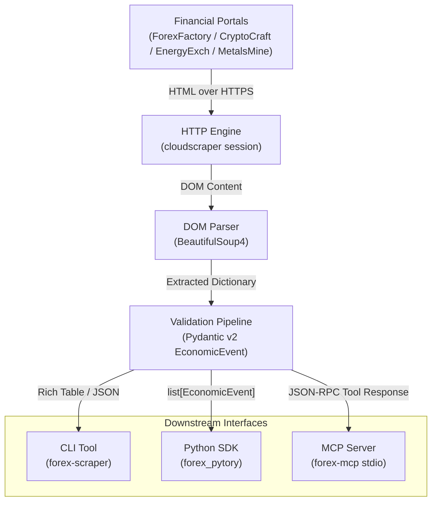

<p align="center">
  
</p>

# forex-pytory

A Python library, CLI, and Model Context Protocol (MCP) server for extracting structured economic calendar events across Forex, Cryptocurrency, Energy, and Precious Metals markets.

[](https://github.com/AtaCanYmc/forex-pytory/actions)
[](https://atacanymc.github.io/forex-pytory/)
[](https://www.python.org/)
[](LICENSE)
[](https://docs.pydantic.dev/)
[](https://modelcontextprotocol.io/)

---

## Table of Contents

- [Overview](#overview)
- [Architecture](#architecture)
- [Supported Markets](#supported-markets)
- [Installation](#installation)
- [Quick Start](#quick-start)
  - [1. Python SDK](#1-python-sdk)
  - [2. Command Line Interface](#2-command-line-interface)
  - [3. Model Context Protocol (MCP) Server](#3-model-context-protocol-mcp-server)
- [CLI Reference](#cli-reference)
- [Data Schema](#data-schema)
- [Development & Testing](#development--testing)
- [Technical FAQ](#technical-faq)
- [License & Disclaimer](#license--disclaimer)

---

## Overview

`forex-pytory` extracts and normalizes macroeconomic calendar releases from the financial portal network consisting of ForexFactory, CryptoCraft, EnergyExch, and MetalsMine.

Key characteristics:
- **Unified Model Output**: All sources map to a single Pydantic v2 schema (`EconomicEvent`).
- **Cloudflare Handling**: Requests use `cloudscraper` to resolve anti-bot JavaScript challenges.
- **Three Operational Interfaces**: Usable as a standard Python package, a standalone terminal CLI, or an MCP server for AI assistants.

---

## Architecture

The following diagram illustrates data flow from upstream financial portals to consumers:



---

## Supported Markets

All target endpoints share identical table structures, parsed through specialized scraper modules:

| Market | Source Portal | Python Module | CLI Flag |
| :--- | :--- | :--- | :--- |
| **Forex** | [ForexFactory](https://www.forexfactory.com/calendar) | `forex_pytory.core.scraper.forex_factory_scraper` | `--source forex` |
| **Crypto** | [CryptoCraft](https://www.cryptocraft.com/calendar) | `forex_pytory.core.scraper.crypto_craft_scraper` | `--source crypto` |
| **Energy** | [EnergyExch](https://www.energyexch.com/calendar) | `forex_pytory.core.scraper.energy_exch_scraper` | `--source energy` |
| **Metals** | [MetalsMine](https://www.metalsmine.com/calendar) | `forex_pytory.core.scraper.metals_mine_scraper` | `--source metals` |

---

## Installation

### Prerequisites

- Python 3.10 or higher
- Git

### Install from Source

Clone the repository and install in editable mode:

```bash
git clone https://github.com/AtaCanYmc/forex-pytory.git
cd forex-pytory
python3 -m venv .venv
source .venv/bin/activate
pip install -e .
```

To install development dependencies (testing, linting, docs):

```bash
pip install -e ".[dev,docs]"
```

---

## Quick Start

### 1. Python SDK

Import a scraper module, construct the target URL for a date, and parse the events:

```python
from datetime import datetime
from forex_pytory.core.scraper import forex_factory_scraper

# Build URL for current date
now = datetime.now()
url = forex_factory_scraper.get_url(day=now.day, month=now.month, year=now.year, timeline="day")

# Fetch and validate records
events = forex_factory_scraper.get_records(url)

# Access typed attributes
for event in events[:5]:
    print(f"{event.time} | {event.currency} | {event.event} | Impact: {event.impact}")
```

### 2. Command Line Interface

After installation, the `forex-scraper` binary is available in your shell environment:

```bash
# Output JSON to stdout (default)
forex-scraper --source forex --format json

# Display color-coded table in terminal
forex-scraper --source crypto --format table

# Query a historical or specific target date
forex-scraper --source energy --date 2026-09-15 --format table
```

### 3. Model Context Protocol (MCP) Server

`forex-pytory` ships with a stdio MCP server (`forex-mcp`) enabling LLM assistants such as Claude Desktop or Cursor to query calendar releases.

#### Register with Claude Desktop

Add the following block to your `claude_desktop_config.json`:

```json
{
  "mcpServers": {
    "forex-pytory": {
      "command": "/path/to/forex-pytory/.venv/bin/forex-mcp",
      "args": []
    }
  }
}
```

The server exposes one primary tool:
- `fetch_economic_events`: Accepts `source` (`forex`, `crypto`, `energy`, `metals`) and optional `date` (`YYYY-MM-DD`).

---

## CLI Reference

The `forex-scraper` command accepts the following arguments:

| Flag | Type | Allowed Values | Default | Description |
| :--- | :--- | :--- | :--- | :--- |
| `--source` | String | `forex`, `crypto`, `energy`, `metals` | `forex` | Target financial calendar to scrape. |
| `--date` | String | Format: `YYYY-MM-DD` | Today | Specific calendar date to query. |
| `--format` | String | `json`, `table` | `json` | Output formatting engine. |
| `-h`, `--help` | Flag | N/A | N/A | Display flag documentation. |

---

## Data Schema

Every event is validated through the `EconomicEvent` Pydantic model:

```python
class EconomicEvent(BaseModel):
    id: Optional[str]        # Calendar event identifier
    time: Optional[str]      # Release timestamp (e.g. '8:30am', 'All Day')
    currency: Optional[str]  # Currency or asset denomination (e.g. 'USD', 'EUR', 'BTC')
    event: Optional[str]     # Title of macroeconomic release
    forecast: Optional[str]  # Market consensus estimate
    actual: Optional[str]    # Published actual value
    previous: Optional[str]  # Previous release value
    impact: Optional[str]    # Impact tier: 'high', 'medium', 'low', or None
```

---

## Development & Testing

Use the repository `Makefile` to trigger standardized workflows:

```bash
# Install package with all development dependencies
make install-dev

# Run static code analysis and formatting checks
make lint

# Automatically format codebase with Black
make format

# Execute test suite
make test

# Build documentation locally
make docs-serve

# Clean build artifacts and bytecode caches
make clean
```

---

## Technical FAQ

#### How does the scraper handle Cloudflare anti-bot checks?
Requests route through `cloudscraper`, an automated Python wrapper around Python `requests` designed to negotiate Cloudflare anti-bot challenges and JavaScript evaluation hurdles without running a headless browser.

#### Are time zones normalized across scrapers?
The source portals display timestamps according to the session timezone cookie. By default, unauthenticated HTTP requests return timestamps in EST/EDT (New York time). When constructing timestamps for automated trade execution, verify local offsets.

#### How does the MCP server communicate with AI agents?
`forex-mcp` implements the standard Model Context Protocol over `stdio`. The agent sends JSON-RPC requests via stdin and receives validated JSON responses via stdout. Logging is redirected to `stderr` to avoid corrupting protocol streams.

---

## License & Disclaimer

- **License**: Apache License 2.0. See [LICENSE](LICENSE) for details.
- **Disclaimer**: The data extracted by this tool is for informational purposes only. See [DISCLAIMER.md](DISCLAIMER.md) for full legal disclosures.
