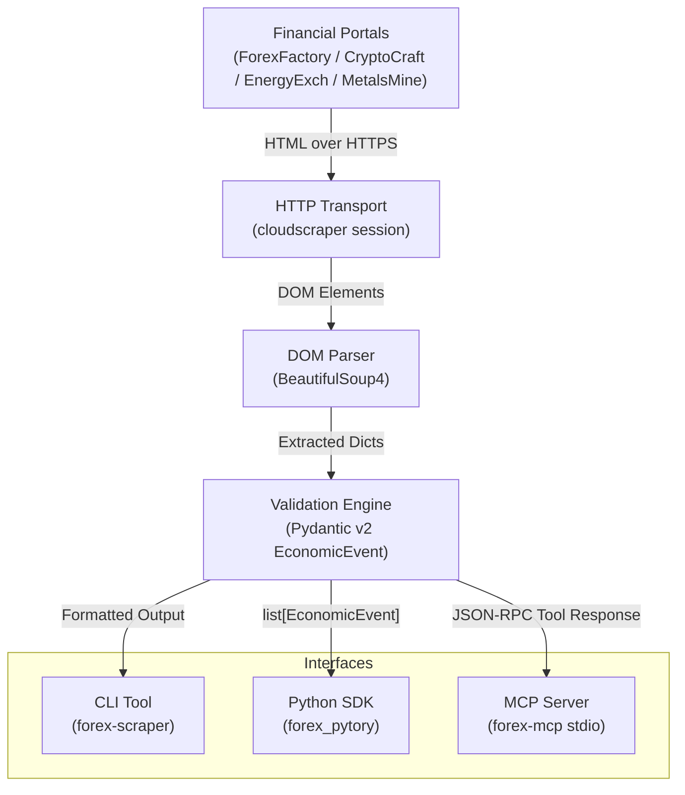

# Forex-Pytory

A Python library, CLI, and Model Context Protocol (MCP) server for extracting structured economic calendar events across Forex, Cryptocurrency, Energy, and Precious Metals markets.

---

## Highlights

- **Multi-Market Coverage**: Scrapes calendar events from ForexFactory, CryptoCraft, EnergyExch, and MetalsMine.
- **Strict Pydantic Validation**: Converts raw HTML tables into strongly-typed `EconomicEvent` data structures.
- **Built-in Cloudflare Bypass**: Employs `cloudscraper` to resolve anti-bot JavaScript hurdles.
- **Three Consumption Interfaces**: Use directly as a Python module, run via terminal CLI, or link into AI agents via MCP.

---

## Architecture Overview

---

## Quick Navigation

- [Getting Started](getting-started.md): Installation and environment preparation.
- [Python SDK Guide](usage/library.md): Using `forex-pytory` in Python code and scripts.
- [CLI Reference](usage/cli.md): Running `forex-scraper` from your terminal.
- [MCP Server Setup](usage/mcp.md): Connecting the scraper to Claude Desktop and Cursor.
- [Supported Markets](scrapers.md): Details on supported financial portals and URL formats.
- [Contributing](contributing.md): Developer workflow and Makefile targets.
