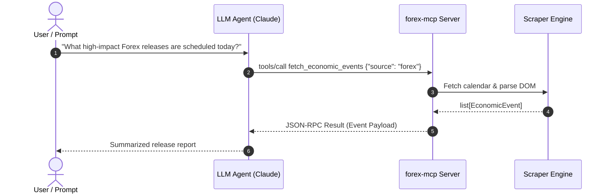

# Model Context Protocol (MCP) Server

`forex-pytory` implements an official Model Context Protocol (MCP) server that enables AI assistants (such as Claude Desktop, Cursor, or custom LLM agents) to query economic calendar releases as callable tools.

---

## Architecture

The MCP server runs locally and communicates with host applications over standard input and output (`stdio`):



---

## Claude Desktop Configuration

Locate your Claude Desktop configuration file:

- **macOS**: `~/Library/Application Support/Claude/claude_desktop_config.json`
- **Windows**: `%APPDATA%\Claude\claude_desktop_config.json`

Add the server configuration under the `mcpServers` block:

```json
{
  "mcpServers": {
    "forex-pytory": {
      "command": "/absolute/path/to/forex-pytory/.venv/bin/forex-mcp",
      "args": []
    }
  }
}
```

Restart Claude Desktop. The hammer icon in the interface will display the `fetch_economic_events` tool.

---

## Tool Specification

### `fetch_economic_events`

Fetches economic calendar events from the specified market source.

**Parameters**:

| Parameter | Type | Required | Description |
| :--- | :--- | :--- | :--- |
| `source` | String | Yes | Market source: `forex`, `crypto`, `energy`, or `metals`. |
| `date` | String | No | Date in `YYYY-MM-DD` format. Defaults to today's date if omitted. |
